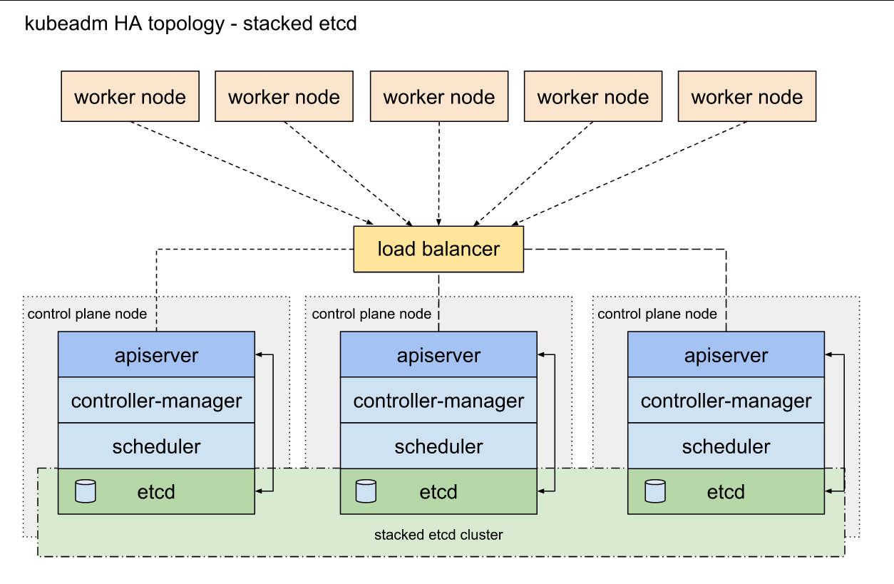
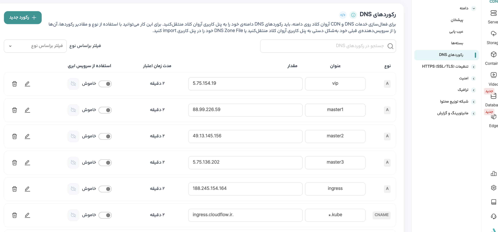

## Install High Available Kubernetes Cluster with Terraform and Ansible on Hetzner Cloud.



This project provides end-to-end automation for setting up a highly available Kubernetes cluster on Hetzner Cloud using Terraform and Ansible. With this project, you can set up a Kubernetes cluster as effortlessly as enjoying a cup of coffee.

## Prerequisites

- **Terraform:** Ensure Terraform is installed on your system.

- **Ansible:** Ensure Ansible is installed on your system.

## Table of Contents:
  1. [Install kubernetes cluster](#Setup-Kubernetes-Cluster)
  2. [Kubernetes Infrastructure Deployment with Terraform (Ingress nginx, cert manager and metrics server)](kubernetes/)
  3. [Kubernetes Monitoring Stack with Prometheus and Loki](observability/)

## Setup Kubernetes Cluster 

### This Project will:

1. Create your Hetzner Cloud (hcloud) resources using Terraform, including Kubernetes nodes, load balancer nodes, a private network, and adding your SSH public key.
2. Convert Terraform output into an Ansible `inventory.ini` file using a Python script.
3. Prepare the servers by installing necessary packages and configuring services.
4. Configure `iptables` on your servers.
5. Configure your SSH service `(sshd)`.
6. Initialize your Kubernetes cluster.
7. Add master nodes to the Kubernetes cluster.
8. Add worker nodes to the Kubernetes cluster.
9. Configure the Kubernetes API server load balancer.
10. Configure the ingress load balancer.

#### Step 1: Clone the Repository

To begin, clone this repository to your local machine:

```bash
git clone https://github.com/siavashmhi/hcloud-autok8s.git
cd hcloud-autok8s
```

#### Step 2: Modify terraform.tfvars

Set your Hetzner Cloud token and SSH public key path in the terraform.tfvars file. Also, configure the virtual machine settings in the virtual_machines variable.

By default, the configuration uses the `cpx31` server type for Kubernetes nodes, which provides `4 CPU cores`, `8GB of memory`, and `160GB of disk` space. and for load balancers, it uses the `cpx11` server type, offering `2 CPU cores`, `2GB of memory`, and `40GB of disk` space. You can adjust the server types as needed.

To view available server types on Hetzner Cloud, run the following commands:
```bash
cat hcloud/server_types.json 

curl -H "Authorization: Bearer your_api_token" https://api.hetzner.cloud/v1/server_types
```

An example terraform.tfvars file:

```bash
cat Infrastructure/terraform.tfvars  

hcloud_password     = "your_hcloud_token"
ssh_public_key_path = "~/.ssh/id_rsa.pub"

virtual_machines = {
  "master1" = {
    server_name     = "master1"
    server_type     = "cpx31" # change
    server_location = "nbg1"
  }

  "master2" = {
    server_name     = "master2"
    server_type     = "cpx31" # change
    server_location = "nbg1"
  }

  "master3" = {
    server_name     = "master3"
    server_type     = "cpx31" # change
    server_location = "nbg1"
  }

  "worker1" = {
    server_name     = "worker1"
    server_type     = "cpx31" # change
    server_location = "nbg1"
  }

  "worker2" = {
    server_name     = "worker2"
    server_type     = "cpx31" # change
    server_location = "nbg1"
  }

  "kube-load-balancer" = {
    server_name     = "kube-load-balancer"
    server_type     = "cpx11" # change
    server_location = "nbg1"
  }

  "ingress-load-balancer" = {
    server_name     = "ingress-load-balancer"
    server_type     = "cpx11" # change
    server_location = "nbg1"
  }

}

```

### Step 3: Modify kubernetes.yml

This is the Ansible variable file used for installing the Kubernetes cluster:

```bash
cat ansible/inventory/group_vars/all/kubernetes.yml 

# master nodes domain
domain_name: "cloudflow.ir"
controlplane_endpoint: "vip.cloudflow.ir:6443"
master1_domain: "master1.cloudflow.ir"
master2_domain: "master2.cloudflow.ir"
master3_domain: "master3.cloudflow.ir"

# kubernetes api server load balancer configurations
lb_sub_domain: "vip"
lb_ip_address: "vip.cloudflow.ir"
haproxy_user: "siavash"
haproxy_password: "cloudflow"

# ingress load balancer configuraions
ingress_haproxy_user: "siavash"
ingress_haproxy_password: "cloudflow"

```

### Step 4: Run the kubernetes.sh Script 

Run the script to create the resources on Hetzner Cloud using Terraform. Once the resources are created, a `Python script will translate Terraform output into an Ansible inventory.ini file`. Then, Ansible playbooks will run for server hardening and Kubernetes installation.

```bash
./scripts/kubernetes.sh   
```

### Step 5: Set DNS Records for Load Balancers and Master Nodes

After 3-5 minutes, retrieve the IP addresses of the servers using this command:

```bash
terraform output -json
```

Once you have the server IPs, set the necessary DNS records.


