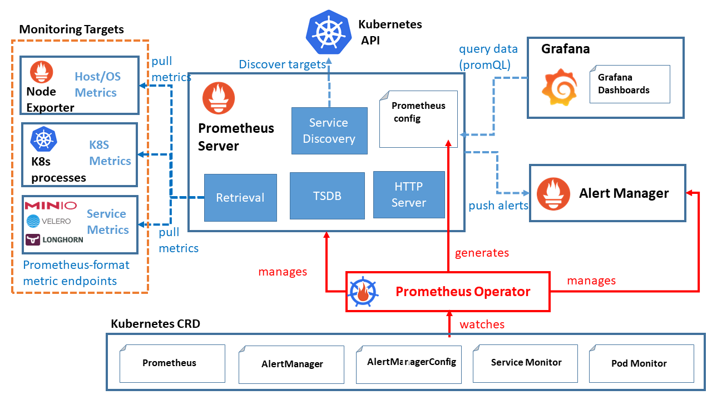

# Kubernetes Monitoring Stack with Prometheus and Loki

This project deploys a complete monitoring stack on Kubernetes using Prometheus, Loki, and Helm. Additionally, it configures secrets and certificates for accessing etcd.

## Terraform will:

1. Install the kube-prometheus-stack Helm chart in the monitoring namespace.
2. Create necessary Kubernetes secrets for Prometheus.
3. Extract etcd certificates and create an etcd-client-cert secret.
4. Install Loki using the loki-stack Helm chart.

## Additional Information

### Promtheus stack artchitect
The Prometheus stack is deployed using the kube-prometheus-stack Helm chart from the Prometheus community. This includes Prometheus, Alertmanager, and Grafana for monitoring and alerting.



### Loki Stack artchitect
Loki is installed using the loki-stack Helm chart from Grafana. Loki is a highly efficient log aggregation system, compatible with Prometheus for log querying in Grafana.


### Etcd Certificate Retrieval
The project retrieves etcd certificates from a pod (default: busybox) running in the default namespace. These certificates are used by Prometheus to monitor etcd.

You can modify the pod used for certificate retrieval by editing the null_resource.get_pod_name section in the Terraform file.

## Prerequisites

Before running this project, ensure you have the following installed:

1. [Terraform](https://www.terraform.io/downloads.html) (version 0.12+)
2. [Helm](https://helm.sh/docs/intro/install/) (version 3.16.1+)
3. [kubectl](https://kubernetes.io/docs/tasks/tools/)
4. A running Kubernetes cluster
5. Correct kubeconfig configuration for access to the cluster

### Optional:

- Experience using Helm, Kubernetes, and Terraform will be beneficial.
- Ensure that you have appropriate permissions to deploy resources in the cluster.

## Project Structure

The project contains the following files:

- `./prometheus/helm.values.yaml` – Configuration values for the Prometheus stack Helm chart.
- `./prometheus/secrets.yml` – YAML for Kubernetes secrets used by Prometheus.
- `./prometheus/get-etcd-cert.yml` – YAML for retrieving etcd certificates.
- `./loki/helm.values.yaml` – Configuration values for the Loki stack Helm chart.

## Steps to Run

### 1. Clone the Repository

Begin by cloning this repository to your local machine:

```bash
git clone https://github.com/siavashmhi/hcloud-autok8s.git
cd hcloud-autok8s/observability
```

### 2. Initialize Terraform

Run the following command to initialize the Terraform configuration:

```bash
terraform init -upgrade
```

### 3. Customize Helm Values 

You can customize the Helm values for Prometheus and Loki by editing the following files:

./prometheus/helm.values.yaml for the Prometheus stack.
./loki/helm.values.yaml for the Loki stack.

helm values for promtheus and grafana and alert manager:

```bash
cat ./prometheus/helm.values.yaml

---
alertmanager:
  ingress:
    enabled: true
    annotations:
      cert-manager.io/cluster-issuer: letsencrypt
      certmanager.k8s.io/acme-http01-edit-in-place: "false"
      kubernetes.io/tls-acme: "true"
      nginx.ingress.kubernetes.io/ssl-redirect: "true"
      nginx.ingress.kubernetes.io/auth-realm: Authentication Required
      nginx.ingress.kubernetes.io/auth-secret: alertmanager-auth
      nginx.ingress.kubernetes.io/auth-type: basic
      nginx.ingress.kubernetes.io/affinity: cookie
    hosts:
      - alertmanager.kube.cloudflow.ir        # AlertManager Url
    ingressClassName: nginx
    tls:
      - secretName: alertmanager-general-tls
        hosts:
          - alertmanager.kube.cloudflow.ir    # AlertManager Url for certificate

  alertmanagerSpec:                       # AlertManager PVC
    storage:
      volumeClaimTemplate:
        spec:
          storageClassName: local-path
          accessModes: ["ReadWriteOnce"]
          resources:
            requests:
              storage: 5Gi

grafana:
  defaultDashboardsTimezone: Asia/Tehran
  adminPassword: Grafana_Admin_Password_sdfsfewkmrkjnrsjfnwek       # Grafana admin user Password
  ingress:
    enabled: true
    annotations:
      cert-manager.io/cluster-issuer: letsencrypt
      certmanager.k8s.io/acme-http01-edit-in-place: "false"
      kubernetes.io/tls-acme: "true"
      nginx.ingress.kubernetes.io/ssl-redirect: "true"
    hosts:
      - grafana.kube.cloudflow.ir                 # Grafana Url
    ingressClassName: nginx
    tls:
      - secretName: grafana-general-tls
        hosts:
          - grafana.kube.cloudflow.ir               # Grafana Url for Certificate
  persistence:                                # Grafana PVC
    type: pvc
    enabled: true
    storageClassName: local-path
    accessModes:
      - ReadWriteOnce
    size: 5Gi
    finalizers:
      - kubernetes.io/pvc-protection

kubeControllerManager:
  service:
    port: 10257
    targetPort: 10257
  serviceMonitor:
    https: true
    insecureSkipVerify: true

kubeEtcd:
  enabled: true
  serviceMonitor:
    enabled: true
    scheme: http
    insecureSkipVerify: false
    serverName: localhost
    caFile: /etc/prometheus/secrets/etcd-client-cert/etcd-ca
    certFile: /etc/prometheus/secrets/etcd-client-cert/etcd-client
    keyFile: /etc/prometheus/secrets/etcd-client-cert/etcd-client-key
  service:
    enabled: true
    port: 2381
    targetPort: 2381

kubeScheduler:
  service:
    port: 10259
    targetPort: 10259
  serviceMonitor:
    https: true
    insecureSkipVerify: true

kubeProxy:
  service:
    port: 10249
    targetPort: 10249

kubelet:
  enabled: true
  namespace: kube-system

prometheus:
  ingress:
    enabled: true
    annotations:
      cert-manager.io/cluster-issuer: letsencrypt
      certmanager.k8s.io/acme-http01-edit-in-place: "false"
      kubernetes.io/tls-acme: "true"
      nginx.ingress.kubernetes.io/ssl-redirect: "true"
      nginx.ingress.kubernetes.io/auth-realm: Authentication Required
      nginx.ingress.kubernetes.io/auth-secret: prometheus-auth
      nginx.ingress.kubernetes.io/auth-type: basic
      nginx.ingress.kubernetes.io/affinity: cookie
    hosts:
      - prometheus.kube.cloudflow.ir                # Prometheus Url
    ingressClassName: nginx
    tls:
      - secretName: prometheus-general-tls
        hosts:
          - prometheus.kube.cloudflow.ir             # Prometheus Url for certificate

  prometheusSpec:                                # Prometheus PVC
    retention: 15d
    storageSpec:
      volumeClaimTemplate:
        spec:
          storageClassName: local-path
          accessModes: ["ReadWriteOnce"]
          resources:
            requests:
              storage: 10Gi
    resources:
      limits:
        cpu: 1500m
        memory: 15Gi
      requests:
        cpu: 500m
        memory: 5Gi
    secrets:
      - etcd-client-cert

```

helm values for loki stack logging system:

```bash
cat ./loki/helm.values.yaml

---
loki:
  enabled: true
  replicas: 1
  persistence:
    enabled: true
    accessModes:
      - ReadWriteOnce
    size: 5Gi
    type: pvc
    storageClassName: local-path 
  limits:
    cpu: 1500m
    memory: 4096Mi
  requests:
    cpu: 500m
    memory: 512Mi
  image:
    pullPolicy: IfNotPresent
    repository: grafana/loki
    tag: 2.9.3

promtail:
  enabled: true
  resources:
    limits:
      cpu: 500m
      memory: 512Mi
    requests:
      cpu: 200m
      memory: 248Mi
```

### 4. Apply the Terraform Configuration

Run the following command to deploy the resources:

```bash
terraform apply
```

### 5. Verify the Deployment

After Terraform finishes, verify that the Prometheus and Loki stacks are running properly:

```bash
kubectl get all -n monitoring
kubectl get all -n loki-stack
```

### Troubleshooting

1. Helm Chart Issues: Ensure the Helm chart repositories are accessible and that your cluster has enough resources.
2. kubectl Errors: If there are issues with accessing the Kubernetes API, check your kubeconfig and cluster credentials.
3. Certificate Retrieval: Ensure the `busybox` pod in the `default namespace` has access to the necessary etcd certificates. You may need to modify the pod name or update the certificate paths.

### Cleanup

If you want to remove the monitoring stack and all associated resources, run:

```bash
terraform destroy
```

### Contributing

Feel free to contribute to this project by submitting a pull request or opening an issue. Any improvements or bug fixes are welcome.
